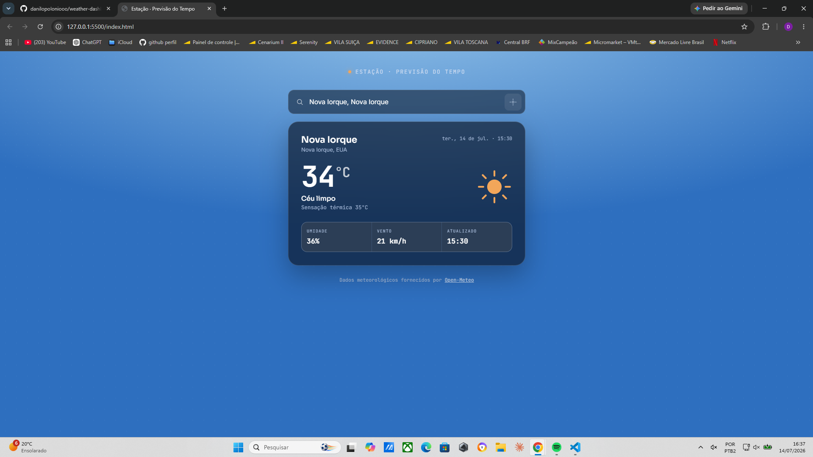

# 🌤️ Weather App

Aplicação de previsão do tempo desenvolvida com **HTML**, **CSS** e **JavaScript**, utilizando a API da **Open-Meteo** para exibir informações meteorológicas em tempo real.

## 📷 Preview



##  Funcionalidades

- Buscar cidades do mundo inteiro
- Buscar clima pela localização atual
- Exibir temperatura
- Exibir sensação térmica
- Exibir umidade do ar
- Exibir velocidade do vento
- Interface responsiva
- Tratamento de erros e carregamento

##  Tecnologias

- HTML5
- CSS3
- JavaScript
- Open-Meteo API

##  Como executar

1. Clone este repositório:

```bash
git clone https://github.com/seu-usuario/weather-app.git
```

2. Abra a pasta do projeto.

3. Execute utilizando um servidor local (como Live Server no VS Code).


